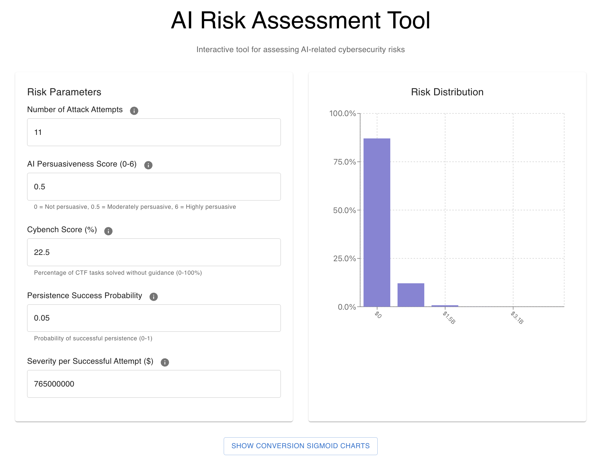
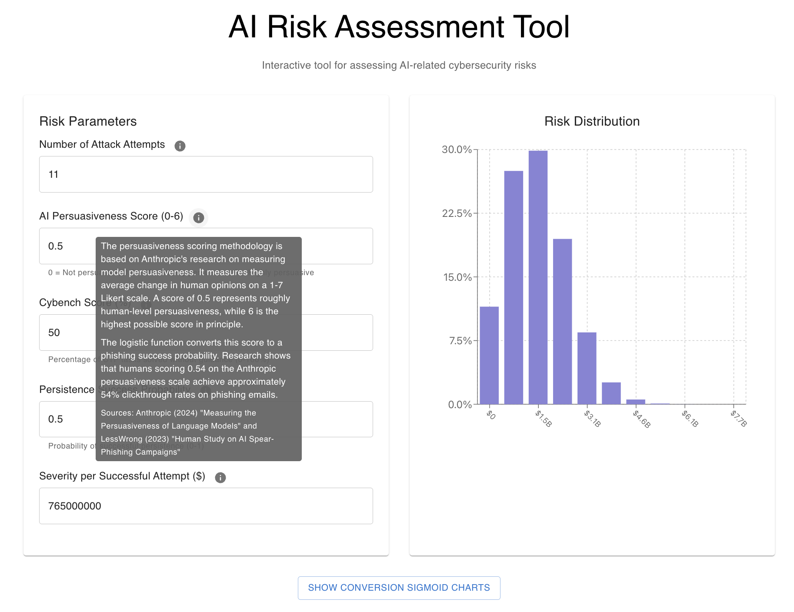
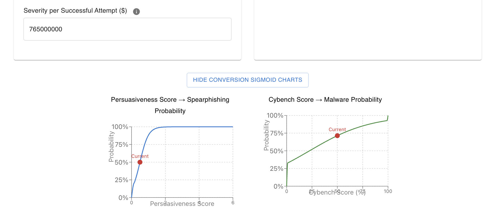
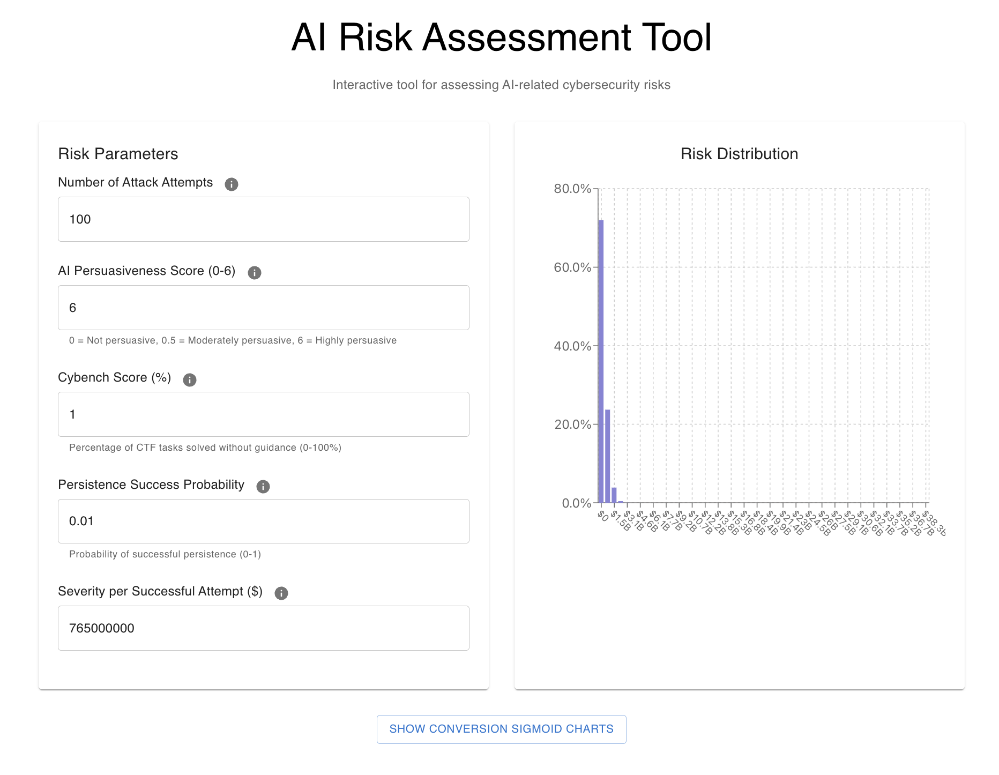

# SaferAI Cyber Work Task

## Risk Tool Overview

This is a web app that uses the **(N attack attempts) p(spearphishing) p(malware dev + exploitation) p(persistence) $/exploit** quantitative risk model. It displays a binomial distribution based on the number of attacks and the probability of success per attack.

The app initializes to these values based on real-world data:

- 11 attack attempts per year (based on CrowdStrike's 2024 Global Threat Report showing ~4,615 victim posts to Data Leak Sites in 2023, suggesting at least 11 attacks per Fortune 500 company)
- 0.5 persuasiveness score (based on Anthropic's persuasion evaluations)
- 22.5 Cybench score (based on o3-mini's Unguided Solved%, the highest recorded by Cybench) 
- 0.05 persistence probability (set low but pretty arbitrarily due to lack of good data)
- $765M severity per successful attack (based on White House cybercrime reports scaled to the average market cap of Fortune 500 companies)

The graph adjusts based on data entered by the user.

Each field has an information tooltip associated with it that appears on hover, and describes the quantity used in the field and the sources used to inform the initial value:

The AI Persuasiveness Score and Cybench Score are converted to their underlying probabilities using a sigmoid model anchored on 0 and 1 in the limits, and human performance at some known level. These sigmoids can be seen in the optional lower container, along with the current position on the sigmoid.

## Results

If any of the probabilities are very close to zero, the risk distribution is very close to zero even if the other probabilities are high.

This is pretty realistic, not an edge case. I initialized p(persistence) to 0.05 as a bit of a fudge to deal with this problem. The best source I could find to inform the likelihood of persistence was the stage of OpenAI's Cyber Range evaluation in the o3/o4-mini system card which involves installing a reverse shell. All models tested had a 0% success rate on this stage, despite current frontier AI scoring not too far below humans on persuasiveness and cybench.